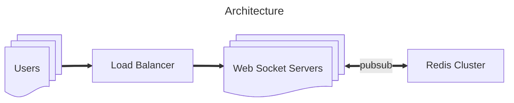
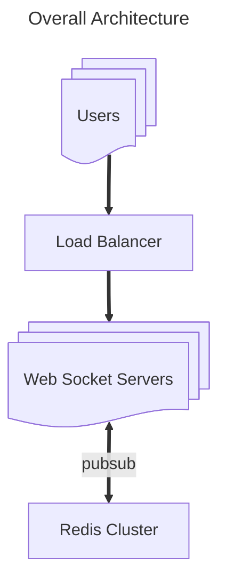

Authors: Emil Bui

Introduction
Over the past few weeks, I’ve been working on a multiplayer web game that can be scaled to millions of users. It is my biggest personal project so far and probably the one that I’ve learned the most during this year. As a backend developer, I don’t have many chances to get my hand on other aspects of software development (like front-end, domain, website, …) as I mostly work on the backend stuff.

So, I want to create a proper product by myself, from start to finish. A scalable multiplayer web game came to my mind. I’ve always wanted to create a Genhsin related web-game and I want to try out scaling websocket so why not?

With that, I decided to create a Genshin Impact Ban Pick web game where you can draft your Genshin team with another player through the ban/pick phases.

Into the Development
Design Architecture
My most important goal on this project is that the game has to be scalable and, from my experience, the best way to make something scalable is to make it stateless. So how do you make the websocket server stateless?
```go
class ConnectionManager:
    def __init__(self):
        self.active_connections: List[WebSocket] = []

    async def connect(self, websocket: WebSocket):
        await websocket.accept()
        self.active_connections.append(websocket)

    def disconnect(self, websocket: WebSocket):
        self.active_connections.remove(websocket)

    async def send_personal_message(self, message: str, websocket: WebSocket):
        await websocket.send_text(message)

    async def broadcast(self, message: str):
        for connection in self.active_connections:
            await connection.send_text(message)


@app.websocket("/ws/{client_id}")
async def websocket_endpoint(websocket: WebSocket, client_id: int):
    await manager.connect(websocket)
    try:
        while True:
            data = await websocket.receive_text()
            await manager.send_personal_message(f"You wrote: {data}", websocket)
            await manager.broadcast(f"Client #{client_id} says: {data}")
    except WebSocketDisconnect:
        manager.disconnect(websocket)
        await manager.broadcast(f"Client #{client_id} left the chat")
```
Most of the time, you will see someone create a websocket server like this to create some chat/broadcast functions. They would create a singleton websocket connection list to store all the current websocket connections to broadcast. The problem with this approach is that this is not scalable as this singleton list is stateful, you cannot scale to multiple instances of this websocket server as this singleton list cannot be shared across instances.

So, to make the websocket server stateless, we need other ways to store this state. One of the best ways to do it is to use a Pubsub service (like Kafka, Redis, …). These services can be scaled up to serve millions to billions of users. Nowadays, you can scale them pretty easily (one button click) if you use services offered by well-known cloud providers (like AWS, Azure, …)

To learn more about the Pubsub model, watch this:

https://www.youtube.com/watch?v=O1PgqUqZKTA

Here is the execution, when the client creates the websocket connection, it should contain the game_id and client_id from the URL params so the server could extract that information to identify and subscribe to the correct game channel. Every time the client makes a move, the move will be transferred through the websocket to the websocket server. The websocket server then processes it and broadcast that move to the game channel, so other websocket connection can receive that move and update the game.

The architecture would look like this



## Scalable Architecture
To better understand this approach, you can watch this video on how to create a scalable real-time chat application using redis and websocket:
[Scaling Websockets with Redis, HAProxy and Node JS - High-availability Group Chat Application](https://www.youtube.com/watch?v=gzIcGhJC8hA)

## Choosing the right tech: Why Redis?

First of all, we need a service to store temporary game states, with every move we make, the game state will change and using redis as a pubsub service as well as game state storage is just perfect. Redis is extremely fast in both read and write speed, sometimes it can be as fast as millions of requests per second. Granted that the data will not be persistent in redis but for a web game, the game state is just temporary information, we don’t have to store it permanently.

Execution: When the game is created, the server will create the game_state and store it in the game_id key in redis. This game state will be used when handling game logic after the player makes a move, then update it accordingly. Since this is a web game, there are a lot of reads and writes happening every move, so redis is perfect for this, also since this is a turn base web game (ban/pick) there shouldn’t be too much move to worry about redis failing since it likely not reach redis limit.

## Coding Websocket Server
Here is the GitHub link to the websocket server code: https://github.com/emilebui/GBP_BE_WS

I’m using Go for this project, Go is fast and with goroutines, you can easily handle the websocket connection and redis pubsub connection simultaneously.

## Front-end Development
This is the hard part as I have little experience in front-end. Luckily for me, there is a project that I can use to build upon, which is: https://github.com/Pustur/genshin-impact-team-randomizer

This web app is somewhat similar to what I want to do so I only have to modify it a bit. It was built using SolidJs — a very interesting front-end framework that I wanted to try. However, it is currently a SPA (Single Page Application) so I don’t want that. I modified the project using Solid-Start (meta-framework) instead for faster initial load time. After adding the websocket, adding game logic, and changing the UI here and there then Voila, I have finished creating the front-end: https://github.com/emilebui/GPB_FE_SolidJS

The experience I have with Solid is great, I used to have some experience with React and Angular and it was not fun (probably the reason why I’m a backend engineer). However, with Solid, it was different, especially with state management, Solid nailed it! I couldn’t have done it without Solid. I recommend everyone to try it out: https://www.solidjs.com/

## Overall Architecture
Here is the overall architecture



Components:

Ingress Nginx: Reverse Proxy + Load balancer
FE: Solid-Start server to render html and js for client
WS: Backend websocket server for handling game logic
Redis: Pubsub + Game state storage

Every component here can be scalable, even the websocket server which can be scaled up to millions of instance to be able to serve billions of users (if there is enough resource)

Here is the deployment project using Kubernetes: https://github.com/emilebui/GBP_Deploy

Other Aspects
Now that the development part is done, there is still a long way to make this game a finished product. I need to find someplace to host it, buy a domain, creating SSL, … There are a lot of processes I had been missing out as I said earlier. Luckily, I got everything sorted out.

Deployment

As scalable as this architecture may seem, it is somewhat sad that I can only deploy this entire project on AWS free-tier account with t2.micro EC2 instance. However, I won’t ever regret making it scalable. It’s been fun working on this game. The deployment was very smooth and easy since I dockerized everything, I just run one command and it just works. Remember, always docker your app. It makes the deployment way easier.

Buying Domain

There is a trick so you can get cheap domains, most of the domain shops offer very cheaply for the first year but an enormous amount in the following year. What you can do is buy the 1st year from a domain store, and after the first year, go to the next store and do the same so you can get a very cheap price.

SSL

Well, I have to thank Cloudflare for providing SSL for free. You only need to register, no credit card is required. The only problem I have when using Cloudflare is that the Minify JS feature broke my game, so I had to turn it off. Other than that, it was perfect, everything is secured, even the websocket connection.

Here is the link to my web game, go check it out: https://genshinbanpick.top/

Conclusion
Thank you so much for reading my blog, I hope this little document can be somewhat helpful to you.

References
https://www.youtube.com/watch?v=gzIcGhJC8hA
https://github.com/emilebui
Web Development
Websocket
